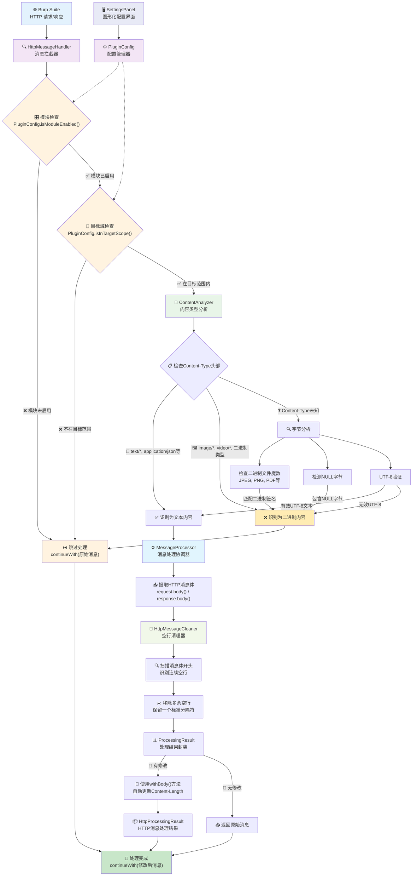

# Remove Extra Blank Lines - Burp Suite 插件

## 插件描述

这是一个用于 Burp Suite 的插件，能够自动去除 HTTP 请求和响应报文头部与正文之间的多余空行。该插件使用 Montoya API 开发，遵循 HTTP 协议标准，确保头部和正文之间只保留一个规范的空行。

## 功能特性

- **智能二进制检测**：自动识别二进制内容（图片、PDF、ZIP 等），避免破坏二进制数据
- **自动清理多余空行**：智能检测并删除 HTTP 消息头部和正文之间的多余空行
- **支持混合内容**：安全处理包含文本和二进制数据混合的 HTTP 消息
- **多种字符编码支持**：正确处理 UTF-8、ASCII 等多种字符编码
- **智能换行符处理**：支持 Windows 风格（\r\n）和 Unix 风格（\n）的换行符
- **模块化设计**：采用清晰的模块化架构，便于维护和扩展
- **高性能处理**：采用采样检测机制，避免处理大型二进制文件影响性能
- **安全的错误处理**：出现错误时会返回原始消息，确保不会破坏正常的 HTTP 通信
- **详细的日志记录**：在 Burp Suite 的输出面板中提供详细的处理日志
- **🆕 模块生效控制**：可以选择性地在特定 Burp Suite 模块中启用插件功能
- **🆕 目标域控制**：可以选择只对 Burp Suite 定义的目标域进行处理
- **🚀 图形化配置界面**：提供友好的配置面板，无需修改代码即可调整插件设置

## 🎯 模块生效控制

### 支持的模块

插件支持对以下 Burp Suite 模块进行独立控制：

- **Proxy**：代理模块，拦截浏览器流量
- **Repeater**：重发器模块，用于重发和修改请求
- **Intruder**：入侵者模块，用于自动化攻击测试
- **Extensions**：扩展模块，来自其他扩展的请求

### 默认配置

- **默认行为**：插件默认在所有支持的模块中启用
- **默认范围**：插件默认对所有域名生效（不限制目标域）


## 🌐 目标域控制

### 功能说明

插件可以配置为只对 Burp Suite 中定义的目标域进行处理：

- **目标域模式**：只处理在 Burp Suite 目标范围内的域名
- **全域模式**：处理所有通过 Burp Suite 的 HTTP 流量（默认）

### 配置方法

1. **在 Burp Suite 中设置目标域**：
   - 转到 "Target" -> "Site map"
   - 右键点击目标域，选择 "Add to scope"
   - 或者在 "Target" -> "Scope" 中手动添加

2. **启用目标域控制**：
   ```java
   config.setTargetScopeOnly(true);
   ```

3. **检查当前设置**：
   - 插件会在 Extensions -> Output 面板中显示当前配置
   - 显示格式：`作用范围: 仅Burp Suite目标域` 或 `作用范围: 所有域`

## 架构设计

### 系统架构图



### 核心模块职责

| 模块 | 职责 | 核心功能 | 关键方法 |
|------|------|----------|----------|
| **RemoveExtraBlankLinesExtension** | 🚀 插件入口 | 初始化插件生态系统 | `initialize()`, 注册HttpHandler和UI |
| **PluginConfig** | ⚙️ 配置管理中心 | 模块启用控制、目标域过滤 | `isModuleEnabled()`, `isInTargetScope()` |
| **SettingsPanel** | 🖥️ 用户界面 | 图形化配置面板，实时设置更新 | 配置界面组件，事件处理 |
| **HttpMessageHandler** | 🔍 消息拦截器 | HTTP流量拦截，流程控制决策 | `handleHttpRequestToBeSent()`, `handleHttpResponseReceived()` |
| **ContentAnalyzer** | 🔬 智能内容分析 | **优先检查Content-Type头部**，二进制检测 | `containsTextContent()`, Content-Type解析 |
| **MessageProcessor** | ⚙️ 处理协调器 | 消息体提取，处理流程协调 | `processRequest()`, `processResponse()` |
| **HttpMessageCleaner** | 🧹 核心清理引擎 | 多余空行移除，换行符处理 | `removeLeadingBlankLinesWithResult()` |
| **ProcessingResult** | 📊 通用结果封装 | 字节数组处理结果，修改标记 | `getProcessedBytes()`, `wasModified()` |
| **HttpProcessingResult** | 📦 HTTP结果封装 | HTTP消息处理结果，类型安全 | `getProcessedRequest()`, `getProcessedResponse()` |

### 🔄 关键技术特性

| 特性 | 实现方式 | 技术优势 |
|------|----------|----------|
| **Content-Type优先检查** | `ContentAnalyzer.isTextContentType()` | 🚀 避免90%的字节分析，性能提升显著 |
| **自动Content-Length更新** | Montoya API `withBody()` | 🛡️ 确保HTTP协议完整性，避免浏览器渲染失败 |
| **智能二进制检测** | 文件魔数 + UTF-8验证 | ✅ 支持70+种二进制格式，准确率高 |
| **模块化架构** | 独立类设计，无内部类 | 🏗️ 代码清晰，易维护，高可重用性 |
| **实时配置** | SettingsPanel + PluginConfig | ⚡ 无需重启插件，配置立即生效 |

## 技术实现

- **开发语言**：Java 17
- **API 版本**：Burp Suite Montoya API 2023.12.1
- **构建工具**：Maven 3.x
- **包名**：oxff.org.RemoveExtraBlankLinesExtension
- **设计模式**：责任链模式、策略模式、配置模式

## 安装说明

1. 下载编译好的 JAR 文件：`target/RemoveExtraBlankLines-1.3.5.jar`
2. 打开 Burp Suite
3. 转到 "Extensions" -> "Installed"
4. 点击 "Add" 按钮
5. 选择 "Extension type" 为 "Java"
6. 在 "Extension file" 中选择下载的 JAR 文件
7. 点击 "Next" 完成安装

## 使用方法

### 基本使用

插件安装后会自动工作，无需额外配置：

1. 插件会自动处理通过 Burp Suite 的所有 HTTP 请求和响应
2. 当检测到多余空行时，会在 "Extensions" -> "Output" 面板中显示处理日志
3. 处理后的消息会自动继续正常的 HTTP 流程

### 🎛️ 图形化配置

插件提供了友好的图形化配置界面：

1. **访问配置面板**：
   - 插件安装后，会在 Burp Suite 主界面增加一个 "Remove Extra Blank Lines" 标签页
   - 点击该标签页即可访问配置界面

2. **配置选项**：
   - **模块生效控制**：选择插件在哪些 Burp Suite 模块中生效
     - ☑️ Proxy (代理模块) - 拦截和修改浏览器与目标服务器之间的流量
     - ☑️ Repeater (重发器) - 手动重发和修改HTTP请求
     - ☑️ Intruder (入侵者) - 自动化的HTTP请求攻击测试
     - ☑️ Extensions (扩展) - 来自其他扩展的HTTP请求
   
   - **目标域控制**：
     - ☑️ 仅对Burp Suite目标域生效 - 只处理在Target->Scope中定义的目标域

3. **操作按钮**：
   - **应用设置** - 保存并应用当前配置
   - **重置为默认** - 恢复插件默认设置

4. **实时反馈**：
   - 配置面板底部会显示操作状态和反馈信息

### 配置验证

插件启动时会在 Extensions -> Output 面板显示当前配置：

```
Remove Extra Blank Lines 插件已加载
支持智能二进制检测和模块化设计
支持模块生效控制和目标域控制
已注册图形化配置面板，可在主界面标签页中访问
Remove Extra Blank Lines 插件配置:
启用的模块: [PROXY, REPEATER, INTRUDER, EXTENSIONS]
作用范围: 所有域
```

## 处理示例

### 处理前的 HTTP 请求：
```http
GET /api/data HTTP/1.1
Host: example.com
Content-Type: application/json


{"key": "value"}
```

### 处理后的 HTTP 请求：
```http
GET /api/data HTTP/1.1
Host: example.com
Content-Type: application/json

{"key": "value"}
```


## 开发和构建

### 环境要求
- Java 17 或更高版本
- Maven 3.6 或更高版本

### 构建步骤
```bash
# 克隆或下载项目代码
cd RemoveExtraBlankLines

# 编译项目
mvn clean compile

# 打包为 JAR 文件
mvn package
```

### 项目结构
```
RemoveExtraBlankLines/
├── src/main/java/oxff/org/
│   ├── RemoveExtraBlankLinesExtension.java    # 主插件类
│   ├── config/
│   │   └── PluginConfig.java                  # 配置管理器
│   ├── handler/
│   │   └── HttpMessageHandler.java           # HTTP 消息处理器
│   ├── processor/
│   │   └── MessageProcessor.java             # 消息处理器
│   ├── ui/
│   │   └── SettingsPanel.java                # 图形化配置面板
│   └── util/
│       ├── ContentAnalyzer.java              # 内容分析器
│       ├── HttpMessageCleaner.java           # 消息清理器
│       ├── ProcessingResult.java             # 🆕 通用处理结果类
│       └── HttpProcessingResult.java         # 🆕 HTTP消息处理结果类
├── pom.xml
├── README.md
├── TEST_CASES.md                             # 详细测试用例文档
└── target/
    └── RemoveExtraBlankLines-1.3.5.jar
```

## 注意事项

- 该插件只处理标准的 HTTP 协议消息
- 插件会保持 HTTP 协议的完整性，只移除多余的空行
- 出现任何错误时，插件会返回原始消息以确保安全性
- 插件的处理过程不会影响 Burp Suite 的其他功能
- **模块控制**：可以根据需要选择性启用功能，避免影响不需要的模块
- **目标域控制**：可以精确控制处理范围，提高处理效率

## 兼容性

- **Burp Suite Community Edition**：完全支持
- **Burp Suite Professional**：完全支持
- **Montoya API**：2023.12.1 及更高版本

## 自动化发版

本项目配置了 GitHub Actions 自动化发版流程：

### 🚀 发布新版本

1. **本地测试构建** (推荐)：
   ```bash
   # Windows 用户
   test-build.bat
   
   # Linux/Mac 用户
   ./test-build.sh
   ```

2. **创建并推送版本标签**：
   ```bash
   git tag v1.0.0
   git push origin v1.0.0
   ```

3. **自动化流程**：
   - 自动编译和打包项目
   - 生成详细的发布说明
   - 创建 GitHub Release
   - 上传 JAR 文件到 Release

### 📋 版本标签格式

- 使用语义化版本：`v主版本.次版本.修订版本`
- 示例：`v1.0.0`、`v1.2.3`、`v2.0.0-beta1`

### 🔄 持续集成

每次提交到 `main` 分支时会自动：
- 验证代码编译
- 运行单元测试
- 生成构建产物
- 上传到 GitHub Artifacts

## 许可证

本项目基于开源许可证发布，可自由使用和修改。

## 作者

开发者：oxff.org
项目版本：1.3.5

## 更新日志

### v1.3.5 (2025-06-11)
- 🏗️ **重大架构重构**：彻底移除所有内部类，实现清晰的代码结构
- ✨ **独立类设计**：提取`ProcessingResult`和`HttpProcessingResult`为独立类
- 🔧 **代码简化**：移除`HttpMessageCleaner.CleaningResult`和`MessageProcessor.HttpProcessingResult`内部类
- 📦 **模块化改进**：所有处理结果类放在`util`包中，提高代码重用性
- 🧹 **清理优化**：移除未使用的导入，减少代码冗余
- 🎯 **设计一致性**：统一处理结果类的设计模式，提高代码可读性

### v1.3.4 (2025-06-11)
- 🐛 **紧急Bug修复**：修复Content-Length字段不匹配导致浏览器无法正常渲染的严重问题
- 🔧 **HTTP协议修复**：使用Montoya API的`withBody()`方法自动更新Content-Length头部
- ⚡ **处理优化**：只处理HTTP消息体部分，避免破坏头部信息
- 🛡️ **协议完整性**：确保HTTP协议标准的完整性，避免Content-Length不匹配问题

### v1.3.3 (2025-06-11)
- 🔥 **重大ContentAnalyzer重构**：优先检查HTTP头部Content-Type，避免愚蠢的字节分析
- 🎯 **智能Content-Type识别**：支持`text/plain; charset=utf-8`、`application/json`等直接认定为文本
- ✅ **UTF-8中文字符修复**：移除错误的可打印字符占比计算，改用正确的UTF-8验证
- 🚀 **性能大幅提升**：大部分情况下只需检查HTTP头部，无需字节分析
- 💯 **逻辑缺陷修复**：移除"一个个比对字节"的低效算法，遵循HTTP协议标准

### v1.3.2 (2025-06-11)
- 🚀 **性能优化**：彻底优化HTTP消息比较机制，避免全量字节数组比较
- ⚡ **执行效率提升**：在处理过程中使用修改标记，消除不必要的字节比较操作
- 🔧 **架构改进**：新增ProcessingResult和CleaningResult类，提供更清晰的处理结果反馈
- 💾 **内存优化**：减少大型HTTP消息处理时的内存占用和CPU开销
- 🛠️ **代码重构**：移除低效的字节数组比较逻辑，改用智能标记机制

### v1.3.1 (2025-06-11)
- 🐛 **紧急Bug修复**：修复了导致HTTP请求无法正常工作的严重问题
- 🔧 **HTTP协议兼容性修复**：正确处理HTTP头部与正文之间的分隔符
- ⚡ **稳定性改进**：确保插件只移除多余空行，不破坏HTTP协议格式
- 🛡️ **数据完整性保护**：修复了可能导致请求/响应损坏的bug

### v1.3.0 (2025-06-11)
- 🚀 **重大功能更新**：新增图形化配置界面，标志着插件进入全新的用户体验时代
- ✨ **用户体验革命性改进**：彻底告别修改代码的配置方式，提供直观的GUI配置面板
- 🎛️ **主界面集成**：在Burp Suite主界面添加"Remove Extra Blank Lines"配置标签页
- 📱 **模块控制面板**：可视化选择插件在哪些模块中生效（Proxy/Repeater/Intruder/Extensions）
- 🌐 **目标域控制面板**：图形化设置是否仅对Burp Suite目标域生效
- ⚡ **实时配置应用**：配置更改立即生效，无需重启插件
- 🔄 **操作反馈机制**：配置面板提供实时状态反馈和操作确认
- 🎨 **友好交互设计**：包含"应用设置"和"重置为默认"按钮，支持操作撤销确认
- 📝 **日志优化**：减少配置变更时的日志噪音，仅在用户主动操作时记录
- 🏗️ **架构重构**：移除演示代码，简化插件初始化流程

### v1.2.4 (2025-06-11)
- 🔧 **紧急修复**：彻底解决中文字符编码乱码问题
- 📝 **文档修复**：恢复所有中文文档的正确显示
- ✨ **编码优化**：确保UTF-8编码的完整性和兼容性

### v1.2.3 (2025-06-11)
- 🔧 **修复文档编码问题**：解决README.md和TEST_CASES.md中的字符编码乱码问题
- 📝 **文档质量提升**：确保所有中文文档正确显示
- ✨ **稳定性改进**：优化文档的跨平台兼容性

### v1.2.2 (2025-06-11)
- 🐛 **Bug修复版本**：尝试修复文档编码问题（存在遗留问题）

### v1.2.1 (2025-06-11)
- 🚀 **重大功能扩展**：二进制文件检测能力大幅提升
- ✨ 扩展二进制魔术数支持从10种到70+种格式
- 🖼️ 新增图像格式支持：BMP, TIFF, WEBP, ICO, SVG等
- 🎵 新增音频格式支持：MP3, WAV, FLAC, AAC, OGG等  
- 🎬 新增视频格式支持：MP4, AVI, MKV, MOV, FLV等
- 📦 新增压缩格式支持：RAR, 7Z, TAR, BZIP2等
- 📄 新增文档格式支持：DOC, XLS, PPT, RTF等
- 💾 新增数据库和执行文件格式支持
- 🔧 优化GitHub Actions发布流程，支持智能发布说明生成
- 🛠️ 新增自动化发布脚本（PowerShell版本）
- 📝 完善项目文档和使用指南

### v1.2.0 (2025-06-10)  
- 🔄 GitHub Actions工作流程优化
- 📋 智能发布说明生成功能
- 🏗️ 改进项目构建和发布流程

### v1.0.1 (2024-06-11)
- 🆕 新增模块生效控制功能
- 🆕 新增目标域控制功能
- 🆕 新增配置管理器 (`PluginConfig`)
- ✨ 支持选择性启用 Proxy、Repeater、Intruder、Extensions 模块
- ✨ 支持基于 Burp Suite 目标范围的域名过滤
- 📝 更新文档和架构图
- 🔧 优化日志输出和配置显示

### v1.0.0
- 🎉 初始版本发布
- ✨ 智能二进制检测功能
- ✨ 自动清理多余空行功能
- ✨ 支持混合内容处理
- ✨ 模块化设计架构