# Remove Extra Blank Lines - Burp Suite 插件

## 插件描述

这是一个用于 Burp Suite 的插件，能够自动去除 HTTP 请求和响应报文头部与正文之间的多余空行。该插件使用 Montoya API 开发，遵循 HTTP 协议标准，确保头部和正文之间只保留一个规范的空行。

## 功能特性

- **智能二进制检测**：自动识别二进制内容（图片、PDF、ZIP 等），避免破坏二进制数据
- **自动清理多余空行**：智能检测并删除 HTTP 消息头部和正文之间的多余空行
- **支持混合内容**：安全处理包含文本和二进制数据混合的 HTTP 消息
- **多种字符编码支持**：正确处理 UTF-8、ASCII 等多种字符编码
- **智能换行符处理**：支持 Windows 风格（\r\n）和 Unix 风格（\n）的换行符
- **模块化设计**：采用清晰的模块化架构，便于维护和扩展
- **高性能处理**：采用采样检测机制，避免处理大型二进制文件影响性能
- **安全的错误处理**：出现错误时会返回原始消息，确保不会破坏正常的 HTTP 通信
- **详细的日志记录**：在 Burp Suite 的输出面板中提供详细的处理日志

## 架构设计

### 系统架构图

```mermaid
graph TD
    A["HTTP 请求/响应"] --> B["HttpMessageHandler"]
    B --> C{"ContentAnalyzer<br/>内容分析"}
    C -->|"文本内容"| D["MessageProcessor<br/>处理器"]
    C -->|"二进制内容"| E["跳过处理<br/>返回原始消息"]
    D --> F["HttpMessageCleaner<br/>清理器"]
    F --> G["处理后的消息"]
    
    C1["检测二进制文件魔数<br/>JPEG, PNG, PDF, ZIP等"]
    C2["计算不可打印字符比例<br/>超过30%视为二进制"]
    C3["检测NULL字节"]
    C1 --> C
    C2 --> C
    C3 --> C
    
    F1["移除多余空行"]
    F2["保持HTTP协议格式"]
    F3["处理不同换行符"]
    F1 --> F
    F2 --> F
    F3 --> F
    
    style A fill:#e1f5fe
    style G fill:#c8e6c9
    style E fill:#ffecb3
    style C fill:#f3e5f5
    style D fill:#e8f5e8
    style F fill:#fff3e0
```



### 模块职责

| 模块 | 职责 | 主要功能 |
|------|------|----------|
| **RemoveExtraBlankLinesExtension** | 插件入口 | 初始化插件，注册处理器 |
| **HttpMessageHandler** | HTTP消息拦截 | 拦截HTTP请求/响应，决定是否处理 |
| **ContentAnalyzer** | 内容分析 | 检测二进制内容，分析字符编码 |
| **MessageProcessor** | 处理协调 | 协调处理流程，分离头部和正文 |
| **HttpMessageCleaner** | 消息清理 | 执行实际的空行清理操作 |

## 技术实现

- **开发语言**：Java 17
- **API 版本**：Burp Suite Montoya API 2023.12.1
- **构建工具**：Maven 3.x
- **包名**：oxff.org.RemoveExtraBlankLinesExtension
- **设计模式**：责任链模式、策略模式

## 安装说明

1. 下载编译好的 JAR 文件：`target/RemoveExtraBlankLines-1.0-SNAPSHOT.jar`
2. 打开 Burp Suite
3. 转到 "Extensions" -> "Installed"
4. 点击 "Add" 按钮
5. 选择 "Extension type" 为 "Java"
6. 在 "Extension file" 中选择下载的 JAR 文件
7. 点击 "Next" 完成安装

## 使用方法

插件安装后会自动工作，无需额外配置：

1. 插件会自动处理通过 Burp Suite 的所有 HTTP 请求和响应
2. 当检测到多余空行时，会在 "Extensions" -> "Output" 面板中显示处理日志
3. 处理后的消息会自动继续正常的 HTTP 流程

## 处理示例

### 处理前的 HTTP 请求：
```http
GET /api/data HTTP/1.1
Host: example.com
Content-Type: application/json


{"key": "value"}
```

### 处理后的 HTTP 请求：
```http
GET /api/data HTTP/1.1
Host: example.com
Content-Type: application/json

{"key": "value"}
```

## 开发和构建

### 环境要求
- Java 17 或更高版本
- Maven 3.6 或更高版本

### 构建步骤
```bash
# 克隆或下载项目代码
cd RemoveExtraBlankLines

# 编译项目
mvn clean compile

# 打包为 JAR 文件
mvn package
```

### 项目结构
```
RemoveExtraBlankLines/
├── src/main/java/oxff/org/
│   ├── RemoveExtraBlankLinesExtension.java    # 主插件类
│   ├── handler/
│   │   └── HttpMessageHandler.java           # HTTP 消息处理器
│   ├── processor/
│   │   └── MessageProcessor.java             # 消息处理器
│   └── util/
│       ├── ContentAnalyzer.java              # 内容分析器
│       └── HttpMessageCleaner.java           # 消息清理器
├── pom.xml
├── README.md
├── TEST_CASES.md                             # 详细测试用例文档
└── target/
    └── RemoveExtraBlankLines-1.0-SNAPSHOT.jar
```

## 注意事项

- 该插件只处理标准的 HTTP 协议消息
- 插件会保持 HTTP 协议的完整性，只移除多余的空行
- 出现任何错误时，插件会返回原始消息以确保安全性
- 插件的处理过程不会影响 Burp Suite 的其他功能

## 兼容性

- **Burp Suite Community Edition**：完全支持
- **Burp Suite Professional**：完全支持
- **Montoya API**：2023.12.1 及更高版本

## 自动化发版

本项目配置了 GitHub Actions 自动化发版流程：

### 🚀 发布新版本

1. **本地测试构建** (推荐)：
   ```bash
   # Windows 用户
   test-build.bat
   
   # Linux/Mac 用户
   ./test-build.sh
   ```

2. **创建并推送版本标签**：
   ```bash
   git tag v1.0.0
   git push origin v1.0.0
   ```

3. **自动化流程**：
   - 自动编译和打包项目
   - 生成详细的发布说明
   - 创建 GitHub Release
   - 上传 JAR 文件到 Release

### 📋 版本标签格式

- 使用语义化版本：`v主版本.次版本.修订版本`
- 示例：`v1.0.0`、`v1.2.3`、`v2.0.0-beta1`

### 🔄 持续集成

每次提交到 `main` 分支时会自动：
- 验证代码编译
- 运行单元测试
- 生成构建产物
- 上传到 GitHub Artifacts

## 许可证

本项目基于开源许可证发布，可自由使用和修改。

## 作者

开发者：oxff.org
项目版本：1.0-SNAPSHOT 