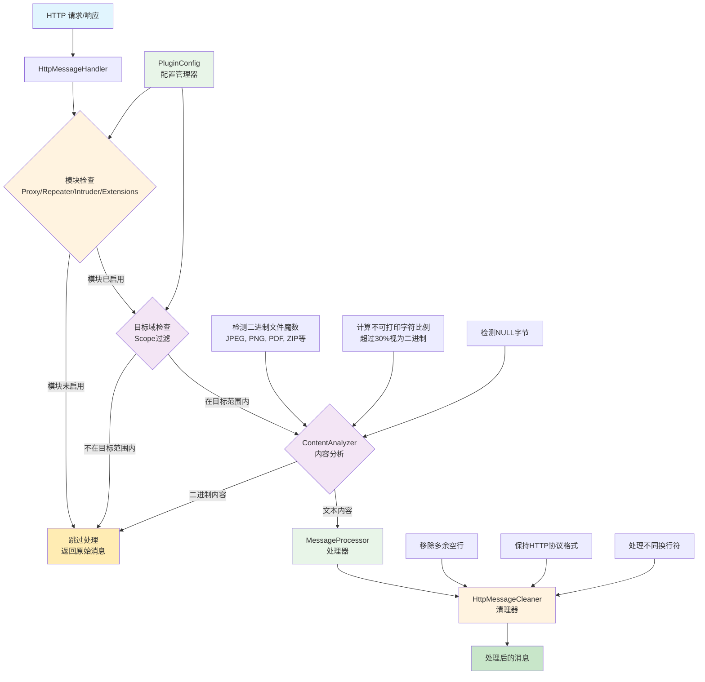

# Remove Extra Blank Lines - Burp Suite 插件

## 插件描述

这是一个用于 Burp Suite 的插件，能够自动去除 HTTP 请求和响应报文头部与正文之间的多余空行。该插件使用 Montoya API 开发，遵循 HTTP 协议标准，确保头部和正文之间只保留一个规范的空行。

## 功能特性

- **智能二进制检测**：自动识别二进制内容（图片、PDF、ZIP 等），避免破坏二进制数据
- **自动清理多余空行**：智能检测并删除 HTTP 消息头部和正文之间的多余空行
- **支持混合内容**：安全处理包含文本和二进制数据混合的 HTTP 消息
- **多种字符编码支持**：正确处理 UTF-8、ASCII 等多种字符编码
- **智能换行符处理**：支持 Windows 风格（\r\n）和 Unix 风格（\n）的换行符
- **模块化设计**：采用清晰的模块化架构，便于维护和扩展
- **高性能处理**：采用采样检测机制，避免处理大型二进制文件影响性能
- **安全的错误处理**：出现错误时会返回原始消息，确保不会破坏正常的 HTTP 通信
- **详细的日志记录**：在 Burp Suite 的输出面板中提供详细的处理日志
- **🆕 模块生效控制**：可以选择性地在特定 Burp Suite 模块中启用插件功能
- **🆕 目标域控制**：可以选择只对 Burp Suite 定义的目标域进行处理

## 🎯 模块生效控制

### 支持的模块

插件支持对以下 Burp Suite 模块进行独立控制：

- **Proxy**：代理模块，拦截浏览器流量
- **Repeater**：重发器模块，用于重发和修改请求
- **Intruder**：入侵者模块，用于自动化攻击测试
- **Extensions**：扩展模块，来自其他扩展的请求

### 默认配置

- **默认行为**：插件默认在所有支持的模块中启用
- **默认范围**：插件默认对所有域名生效（不限制目标域）

### 配置示例

```java
// 示例1: 只在 Proxy 和 Repeater 模块中启用
config.setEnabledModules(EnumSet.of(ToolType.PROXY, ToolType.REPEATER));

// 示例2: 只对目标域生效
config.setTargetScopeOnly(true);

// 示例3: 禁用 Intruder 模块
config.disableModule(ToolType.INTRUDER);

// 示例4: 启用所有模块但只对目标域生效
config.setEnabledModules(EnumSet.of(
    ToolType.PROXY, 
    ToolType.REPEATER, 
    ToolType.INTRUDER, 
    ToolType.EXTENSIONS
));
config.setTargetScopeOnly(true);
```

## 🌐 目标域控制

### 功能说明

插件可以配置为只对 Burp Suite 中定义的目标域进行处理：

- **目标域模式**：只处理在 Burp Suite 目标范围内的域名
- **全域模式**：处理所有通过 Burp Suite 的 HTTP 流量（默认）

### 配置方法

1. **在 Burp Suite 中设置目标域**：
   - 转到 "Target" -> "Site map"
   - 右键点击目标域，选择 "Add to scope"
   - 或者在 "Target" -> "Scope" 中手动添加

2. **启用目标域控制**：
   ```java
   config.setTargetScopeOnly(true);
   ```

3. **检查当前设置**：
   - 插件会在 Extensions -> Output 面板中显示当前配置
   - 显示格式：`作用范围: 仅Burp Suite目标域` 或 `作用范围: 所有域`

## 架构设计

### 系统架构图



### 模块职责

| 模块 | 职责 | 主要功能 |
|------|------|----------|
| **RemoveExtraBlankLinesExtension** | 插件入口 | 初始化插件，配置管理，注册处理器 |
| **PluginConfig** | 配置管理 | 管理模块控制和目标域设置 |
| **HttpMessageHandler** | HTTP消息拦截 | 拦截HTTP请求/响应，应用过滤规则 |
| **ContentAnalyzer** | 内容分析 | 检测二进制内容，分析字符编码 |
| **MessageProcessor** | 处理协调 | 协调处理流程，分离头部和正文 |
| **HttpMessageCleaner** | 消息清理 | 执行实际的空行清理操作 |

## 技术实现

- **开发语言**：Java 17
- **API 版本**：Burp Suite Montoya API 2023.12.1
- **构建工具**：Maven 3.x
- **包名**：oxff.org.RemoveExtraBlankLinesExtension
- **设计模式**：责任链模式、策略模式、配置模式

## 安装说明

1. 下载编译好的 JAR 文件：`target/RemoveExtraBlankLines-1.0.1.jar`
2. 打开 Burp Suite
3. 转到 "Extensions" -> "Installed"
4. 点击 "Add" 按钮
5. 选择 "Extension type" 为 "Java"
6. 在 "Extension file" 中选择下载的 JAR 文件
7. 点击 "Next" 完成安装

## 使用方法

### 基本使用

插件安装后会自动工作，无需额外配置：

1. 插件会自动处理通过 Burp Suite 的所有 HTTP 请求和响应
2. 当检测到多余空行时，会在 "Extensions" -> "Output" 面板中显示处理日志
3. 处理后的消息会自动继续正常的 HTTP 流程

### 高级配置

如需自定义插件行为，可以修改源代码中的配置示例：

1. 打开 `RemoveExtraBlankLinesExtension.java`
2. 在 `demonstrateConfigUsage` 方法中取消注释相应的配置代码
3. 重新编译和安装插件

### 配置验证

插件启动时会在 Extensions -> Output 面板显示当前配置：

```
Remove Extra Blank Lines 插件配置:
启用的模块: [PROXY, REPEATER, INTRUDER, EXTENSIONS]
作用范围: 所有域

=== 配置功能演示 ===
配置功能演示完成，当前使用默认配置
可通过修改代码中的示例来测试不同配置
===================
```

## 处理示例

### 处理前的 HTTP 请求：
```http
GET /api/data HTTP/1.1
Host: example.com
Content-Type: application/json


{"key": "value"}
```

### 处理后的 HTTP 请求：
```http
GET /api/data HTTP/1.1
Host: example.com
Content-Type: application/json

{"key": "value"}
```

## 使用场景

### 场景1: 只在代理模块使用
```java
// 只在浏览器流量中清理多余空行
config.setEnabledModules(EnumSet.of(ToolType.PROXY));
```

### 场景2: 渗透测试专用
```java
// 只在手动测试工具中使用，避免影响自动化测试
config.setEnabledModules(EnumSet.of(ToolType.REPEATER));
config.setTargetScopeOnly(true);
```

### 场景3: 全面清理但限制目标
```java
// 所有模块都启用，但只处理特定目标
config.setTargetScopeOnly(true);
```

## 开发和构建

### 环境要求
- Java 17 或更高版本
- Maven 3.6 或更高版本

### 构建步骤
```bash
# 克隆或下载项目代码
cd RemoveExtraBlankLines

# 编译项目
mvn clean compile

# 打包为 JAR 文件
mvn package
```

### 项目结构
```
RemoveExtraBlankLines/
├── src/main/java/oxff/org/
│   ├── RemoveExtraBlankLinesExtension.java    # 主插件类
│   ├── config/
│   │   └── PluginConfig.java                  # 配置管理器
│   ├── handler/
│   │   └── HttpMessageHandler.java           # HTTP 消息处理器
│   ├── processor/
│   │   └── MessageProcessor.java             # 消息处理器
│   └── util/
│       ├── ContentAnalyzer.java              # 内容分析器
│       └── HttpMessageCleaner.java           # 消息清理器
├── pom.xml
├── README.md
├── TEST_CASES.md                             # 详细测试用例文档
└── target/
    └── RemoveExtraBlankLines-1.2.1.jar
```

## 注意事项

- 该插件只处理标准的 HTTP 协议消息
- 插件会保持 HTTP 协议的完整性，只移除多余的空行
- 出现任何错误时，插件会返回原始消息以确保安全性
- 插件的处理过程不会影响 Burp Suite 的其他功能
- **模块控制**：可以根据需要选择性启用功能，避免影响不需要的模块
- **目标域控制**：可以精确控制处理范围，提高处理效率

## 兼容性

- **Burp Suite Community Edition**：完全支持
- **Burp Suite Professional**：完全支持
- **Montoya API**：2023.12.1 及更高版本

## 自动化发版

本项目配置了 GitHub Actions 自动化发版流程：

### 🚀 发布新版本

1. **本地测试构建** (推荐)：
   ```bash
   # Windows 用户
   test-build.bat
   
   # Linux/Mac 用户
   ./test-build.sh
   ```

2. **创建并推送版本标签**：
   ```bash
   git tag v1.0.0
   git push origin v1.0.0
   ```

3. **自动化流程**：
   - 自动编译和打包项目
   - 生成详细的发布说明
   - 创建 GitHub Release
   - 上传 JAR 文件到 Release

### 📋 版本标签格式

- 使用语义化版本：`v主版本.次版本.修订版本`
- 示例：`v1.0.0`、`v1.2.3`、`v2.0.0-beta1`

### 🔄 持续集成

每次提交到 `main` 分支时会自动：
- 验证代码编译
- 运行单元测试
- 生成构建产物
- 上传到 GitHub Artifacts

## 许可证

本项目基于开源许可证发布，可自由使用和修改。

## 作者

开发者：oxff.org
项目版本：1.2.1

## 更新日志

### v1.2.1 (2025-06-11)
- 🚀 **重大功能扩展**：二进制文件检测能力大幅提升
- ✨ 扩展二进制魔术数支持从10种到70+种格式
- 🖼️ 新增图像格式支持：BMP, TIFF, WEBP, ICO, SVG等
- 🎵 新增音频格式支持：MP3, WAV, FLAC, AAC, OGG等  
- 🎬 新增视频格式支持：MP4, AVI, MKV, MOV, FLV等
- 📦 新增压缩格式支持：RAR, 7Z, TAR, BZIP2等
- 📄 新增文档格式支持：DOC, XLS, PPT, RTF等
- 💾 新增数据库和执行文件格式支持
- 🔧 优化GitHub Actions发布流程，支持智能发布说明生成
- 🛠️ 新增自动化发布脚本（PowerShell版本）
- 📝 完善项目文档和使用指南

### v1.2.0 (2025-06-10)  
- 🔄 GitHub Actions工作流程优化
- 📋 智能发布说明生成功能
- 🏗️ 改进项目构建和发布流程

### v1.0.1 (2024-06-11)
- 🆕 新增模块生效控制功能
- 🆕 新增目标域控制功能
- 🆕 新增配置管理器 (`PluginConfig`)
- ✨ 支持选择性启用 Proxy、Repeater、Intruder、Extensions 模块
- ✨ 支持基于 Burp Suite 目标范围的域名过滤
- 📝 更新文档和架构图
- 🔧 优化日志输出和配置显示

### v1.0.0
- 🎉 初始版本发布
- ✨ 智能二进制检测功能
- ✨ 自动清理多余空行功能
- ✨ 支持混合内容处理
- ✨ 模块化设计架构 